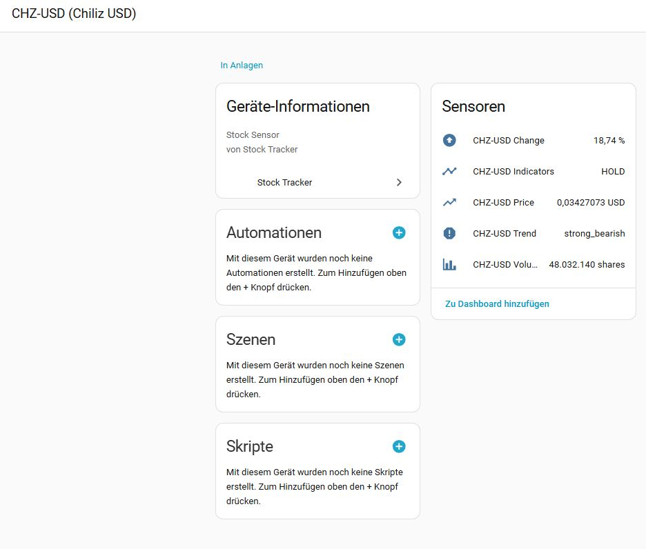
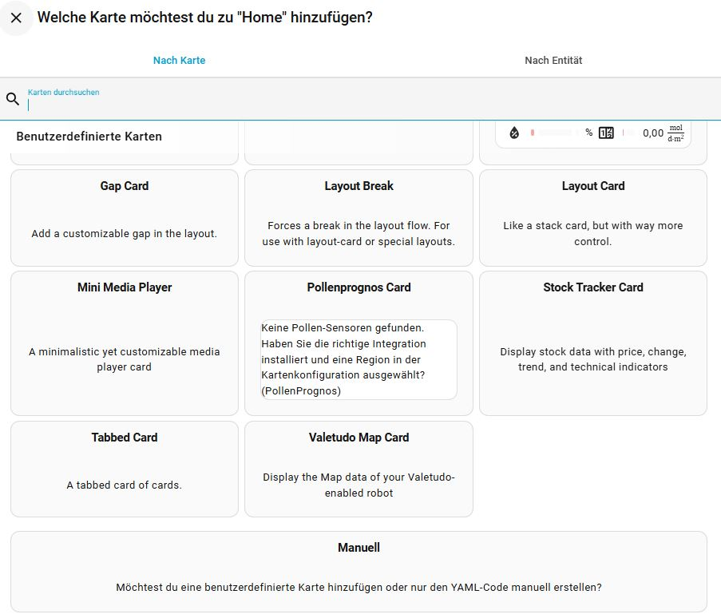
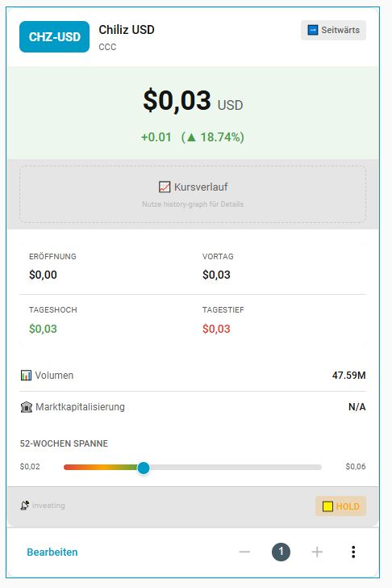
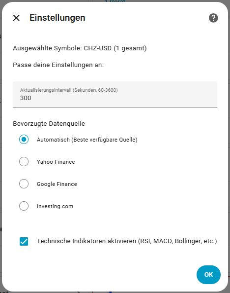
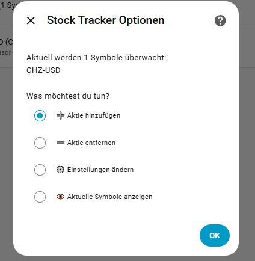
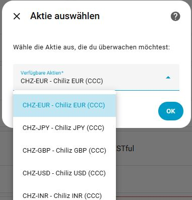

<div align="center">

# 📊 Stock Tracker for Home Assistant

[](https://github.com/hacs/integration)
[](https://github.com/richieam93/ha-stock-tracker/releases)
[](LICENSE)
[](https://github.com/richieam93/ha-stock-tracker/stargazers)

**Verfolge Aktien, ETFs und Kryptowährungen direkt in Home Assistant!**

*Track stocks, ETFs, and cryptocurrencies directly in Home Assistant!*

[🇩🇪 Deutsch](#-deutsche-dokumentation) | [🇬🇧 English](#-english-documentation)

<a href="https://www.buymeacoffee.com/geartec" target="_blank">
  
</a>

---


</div>

---

## ✨ Features / Funktionen

| Feature | Description / Beschreibung |
|---------|---------------------------|
| 📈 **Real-time Stock Prices** | Track any stock from NASDAQ, NYSE, XETRA, and more |
| 🪙 **Cryptocurrencies** | Bitcoin, Ethereum, and 500+ other coins |
| 📊 **Technical Indicators** | RSI, MACD, Bollinger Bands, Stochastic, ADX |
| 🔮 **Trend Analysis** | Automatic trend detection with strength indicator |
| 🔍 **Smart Search** | Search by company name or symbol |
| 🔔 **Automations** | Price alerts, RSI signals, trend changes |
| 🎨 **Custom Card** | Beautiful Lovelace card included |
| 🌍 **Multi-Language** | English & German |
| 🔄 **Auto-Update** | New stocks available automatically |
| 🔑 **No API Key** | Works out of the box! |

---

# 🇩🇪 Deutsche Dokumentation

## 📸 Screenshots

<details>
<summary>📊 Sensoren (klicken zum Öffnen)</summary>



**5 Sensoren werden pro Aktie erstellt:**
- **Price** - Aktueller Kurs mit allen Fundamentaldaten
- **Change** - Tagesänderung in Prozent
- **Trend** - Trendrichtung (bullish/bearish/neutral)
- **Volume** - Handelsvolumen
- **Indicators** - Technische Indikatoren (RSI, MACD, etc.)

</details>

<details>
<summary>🎨 Custom Card (klicken zum Öffnen)</summary>





**3 Anzeige-Modi:**
- **Vollständig** - Alle Details inkl. technischer Analyse
- **Kompakt** - Kurs, Änderung und Trend
- **Mini** - Nur eine Zeile für Dashboard-Übersichten

</details>

<details>
<summary>⚙️ Einstellungen (klicken zum Öffnen)</summary>





</details>

<details>
<summary>🔍 Aktiensuche (klicken zum Öffnen)</summary>



</details>

---

## 📦 Installation

### Methode 1: HACS (Empfohlen)

1. Öffne **HACS** in Home Assistant
2. Klicke auf **Integrationen**
3. Klicke auf die **3 Punkte** oben rechts → **Benutzerdefinierte Repositories**
4. Füge hinzu:
   - **Repository:** `https://github.com/richieam93/ha-stock-tracker`
   - **Kategorie:** `Integration`
5. Klicke auf **Hinzufügen**
6. Suche nach **"Stock Tracker"** und installiere es
7. **Starte Home Assistant neu**

### Methode 2: Manuell

1. Lade die [neueste Version](https://github.com/richieam93/ha-stock-tracker/releases) herunter
2. Kopiere den Ordner `custom_components/stock_tracker` nach `config/custom_components/`
3. Starte Home Assistant neu

---

## ⚙️ Einrichtung

1. Gehe zu **Einstellungen** → **Geräte & Dienste**
2. Klicke auf **+ Integration hinzufügen**
3. Suche nach **"Stock Tracker"**
4. Gib deine Aktien-Symbole ein:

| Markt | Beispiele |
|-------|-----------|
| 🇺🇸 US-Aktien | `AAPL`, `MSFT`, `GOOGL`, `TSLA` |
| 🇩🇪 Deutsche Aktien | `SAP.DE`, `BMW.DE`, `SIE.DE` |
| 🪙 Krypto | `BTC-USD`, `ETH-USD` |
| 📊 ETFs | `SPY`, `QQQ`, `VOO` |
| 📈 Indizes | `^GSPC` (S&P 500), `^GDAXI` (DAX) |

5. Klicke auf **Absenden** - fertig! 🎉

### 🔄 Automatische Updates

Die Integration aktualisiert sich automatisch:
- **Neue Aktien** sind sofort verfügbar sobald du sie hinzufügst
- **Kursdaten** werden alle 5 Minuten aktualisiert (konfigurierbar)
- **Symbol-Datenbank** wird täglich aktualisiert

---

## 🎨 Custom Card verwenden

### Im Visual Editor

1. Gehe zu einem Dashboard
2. Klicke auf **Karte hinzufügen**
3. Suche nach **"Stock Tracker"**
4. Wähle deine Aktie aus dem Dropdown
5. Konfiguriere den Anzeige-Modus

### Manuelle YAML-Konfiguration

```yaml
type: custom:stock-tracker-card
entity: sensor.aapl_price
display_mode: full
show_indicators: true
show_chart: true
name: Meine Apple Aktie
```

**Parameter:**

| Parameter | Werte | Beschreibung |
|-----------|-------|--------------|
| `entity` | `sensor.xxx_price` | Preis-Sensor der Aktie |
| `display_mode` | `full`, `compact`, `mini` | Anzeige-Modus |
| `show_indicators` | `true`, `false` | Technische Indikatoren anzeigen |
| `show_chart` | `true`, `false` | Chart-Bereich anzeigen |
| `name` | Text | Eigener Name (optional) |

### Beispiel-Dashboard

```yaml
type: vertical-stack
cards:
  - type: markdown
    content: "# 📊 Mein Portfolio"
  - type: horizontal-stack
    cards:
      - type: custom:stock-tracker-card
        entity: sensor.aapl_price
        display_mode: compact
      - type: custom:stock-tracker-card
        entity: sensor.msft_price
        display_mode: compact
  - type: custom:stock-tracker-card
    entity: sensor.googl_price
    display_mode: full
  - type: history-graph
    title: Kursverlauf
    hours_to_show: 24
    entities:
      - entity: sensor.aapl_price
        name: Apple
      - entity: sensor.msft_price
        name: Microsoft
```

---

## 📊 Verfügbare Sensoren

Für jede Aktie werden **5 Sensoren** erstellt:

### 1. Preis-Sensor (`sensor.{symbol}_price`)

| Attribut | Beschreibung |
|----------|--------------|
| `price` | Aktueller Kurs |
| `change` | Absolute Änderung |
| `change_percent` | Prozentuale Änderung |
| `previous_close` | Vortagesschluss |
| `today_open` | Eröffnungskurs |
| `today_high` | Tageshoch |
| `today_low` | Tagestief |
| `volume` | Handelsvolumen |
| `market_cap` | Marktkapitalisierung |
| `pe_ratio` | KGV (Kurs-Gewinn-Verhältnis) |
| `eps` | Gewinn pro Aktie |
| `dividend_yield` | Dividendenrendite |
| `52_week_high` | 52-Wochen-Hoch |
| `52_week_low` | 52-Wochen-Tief |
| `week_change_percent` | Wochenänderung |
| `month_change_percent` | Monatsänderung |
| `ytd_change_percent` | Jahr-bis-dato Änderung |

### 2. Änderungs-Sensor (`sensor.{symbol}_change`)

Zeigt die prozentuale Tagesänderung mit Richtungsanzeige.

### 3. Trend-Sensor (`sensor.{symbol}_trend`)

| Wert | Bedeutung | Icon |
|------|-----------|------|
| `strong_bullish` | Stark steigend | 🚀 |
| `bullish` | Steigend | 📈 |
| `neutral` | Seitwärts | ➡️ |
| `bearish` | Fallend | 📉 |
| `strong_bearish` | Stark fallend | 🔻 |

### 4. Volumen-Sensor (`sensor.{symbol}_volume`)

Aktuelles Handelsvolumen mit Vergleich zum Durchschnitt.

### 5. Indikatoren-Sensor (`sensor.{symbol}_indicators`)

| Attribut | Beschreibung |
|----------|--------------|
| `rsi_14` | Relative Stärke Index (0-100) |
| `macd` | MACD Wert |
| `macd_signal` | MACD Signallinie |
| `macd_trend` | MACD Trend (bullish/bearish) |
| `bollinger_upper` | Oberes Bollinger Band |
| `bollinger_middle` | Mittleres Bollinger Band (SMA20) |
| `bollinger_lower` | Unteres Bollinger Band |
| `stochastic_k` | Stochastic %K |
| `stochastic_d` | Stochastic %D |
| `adx` | Average Directional Index |
| `atr` | Average True Range |
| `overall_signal` | Gesamtsignal (BUY/HOLD/SELL) |

---

## 🔧 Services

### `stock_tracker.add_stock`

Fügt eine neue Aktie hinzu. Die Sensoren werden automatisch erstellt.

```yaml
service: stock_tracker.add_stock
data:
  symbol: NVDA
```

### `stock_tracker.remove_stock`

Entfernt eine Aktie und alle zugehörigen Sensoren.

```yaml
service: stock_tracker.remove_stock
data:
  symbol: NVDA
```

### `stock_tracker.search`

Sucht nach Aktien und zeigt Ergebnisse als Benachrichtigung.

```yaml
service: stock_tracker.search
data:
  query: Tesla
  limit: 10
```

### `stock_tracker.refresh`

Aktualisiert alle Kursdaten sofort.

```yaml
service: stock_tracker.refresh
```

### `stock_tracker.update_database`

Aktualisiert die lokale Symbol-Datenbank.

```yaml
service: stock_tracker.update_database
```

---

## 🤖 Automatisierungen

### Preis-Alarm

```yaml
alias: Apple über 200 Dollar
description: Benachrichtigung wenn Apple über 200$ steigt
trigger:
  - platform: numeric_state
    entity_id: sensor.aapl_price
    above: 200
action:
  - service: notify.mobile_app_iphone
    data:
      title: "📈 Kurs-Alarm!"
      message: "Apple ist über $200: {{ states('sensor.aapl_price') }}$"
```

### RSI Überverkauft-Signal

```yaml
alias: RSI Kaufsignal Apple
description: Benachrichtigung bei RSI unter 30
trigger:
  - platform: template
    value_template: >
      {{ state_attr('sensor.aapl_indicators', 'rsi_14') | float(50) < 30 }}
action:
  - service: notify.mobile_app_iphone
    data:
      title: "💡 Kaufsignal"
      message: >
        Apple RSI ist {{ state_attr('sensor.aapl_indicators', 'rsi_14') | round(1) }}
        - mögliche Kaufgelegenheit!
```

### Trend-Wechsel Erkennung

```yaml
alias: Trend-Wechsel Warnung
description: Warnt bei Wechsel von bullish zu bearish
trigger:
  - platform: state
    entity_id: sensor.aapl_trend
    from: bullish
    to: bearish
  - platform: state
    entity_id: sensor.aapl_trend
    from: strong_bullish
    to: bearish
action:
  - service: notify.mobile_app_iphone
    data:
      title: "⚠️ Trend-Warnung"
      message: "Apple Trend ist jetzt bearish!"
```

### Tägliche Portfolio-Zusammenfassung

```yaml
alias: Tägliche Portfolio Zusammenfassung
description: Sendet jeden Abend eine Übersicht
trigger:
  - platform: time
    at: "18:00:00"
condition:
  - condition: time
    weekday:
      - mon
      - tue
      - wed
      - thu
      - fri
action:
  - service: notify.mobile_app_iphone
    data:
      title: "📊 Portfolio Update"
      message: >
        Apple: {{ states('sensor.aapl_change') }}%
        Microsoft: {{ states('sensor.msft_change') }}%
        Google: {{ states('sensor.googl_change') }}%
        Bitcoin: {{ states('sensor.btc_usd_change') }}%
```

### Volumen-Alarm

```yaml
alias: Hohes Volumen Alarm
description: Warnt bei ungewöhnlich hohem Handelsvolumen
trigger:
  - platform: template
    value_template: >
      
      {{ ratio > 2 }}
action:
  - service: notify.mobile_app_iphone
    data:
      title: "📊 Volumen-Alarm"
      message: >
        Apple hat ungewöhnlich hohes Volumen!
        {{ state_attr('sensor.aapl_volume', 'volume_ratio') | round(1) }}x über Durchschnitt
```

---

## ❓ FAQ - Häufige Fragen

<details>
<summary><b>Wie oft werden die Daten aktualisiert?</b></summary>

Standardmäßig alle 5 Minuten. Du kannst das Intervall in den Einstellungen zwischen 1-60 Minuten konfigurieren:

1. Einstellungen → Geräte & Dienste → Stock Tracker
2. Klicke auf **Konfigurieren**
3. Wähle **Einstellungen ändern**
4. Stelle das gewünschte Intervall ein

</details>

<details>
<summary><b>Warum zeigt meine Aktie "unavailable"?</b></summary>

Mögliche Gründe:
- **Falsches Symbol** - Prüfe ob das Symbol korrekt ist (z.B. `SAP.DE` für deutsche Aktien)
- **Markt geschlossen** - Am Wochenende und Feiertagen sind Börsen geschlossen
- **Netzwerk-Problem** - Prüfe deine Internetverbindung

**Lösung:** Versuche die Daten manuell zu aktualisieren:

```yaml
service: stock_tracker.refresh
```

</details>

<details>
<summary><b>Kann ich Kryptowährungen tracken?</b></summary>

Ja! Verwende das Format `SYMBOL-USD`:

| Krypto | Symbol |
|--------|--------|
| Bitcoin | `BTC-USD` |
| Ethereum | `ETH-USD` |
| Dogecoin | `DOGE-USD` |
| Solana | `SOL-USD` |
| Cardano | `ADA-USD` |

</details>

<details>
<summary><b>Wie füge ich deutsche Aktien hinzu?</b></summary>

Hänge `.DE` an das Symbol an:

| Unternehmen | Symbol |
|-------------|--------|
| SAP | `SAP.DE` |
| BMW | `BMW.DE` |
| Siemens | `SIE.DE` |
| Volkswagen | `VOW3.DE` |
| Allianz | `ALV.DE` |
| Deutsche Bank | `DBK.DE` |

</details>

<details>
<summary><b>Wie füge ich weitere Aktien hinzu?</b></summary>

**Methode 1: Über die UI**
1. Einstellungen → Geräte & Dienste → Stock Tracker
2. Klicke auf **Konfigurieren**
3. Wähle **Aktie hinzufügen**
4. Suche oder gib das Symbol ein

**Methode 2: Über Service**

```yaml
service: stock_tracker.add_stock
data:
  symbol: NVDA
```

</details>

<details>
<summary><b>Die Custom Card wird nicht angezeigt</b></summary>

1. **Browser-Cache leeren** - Drücke `Strg+Shift+R` oder `Cmd+Shift+R`
2. **Inkognito-Modus testen** - Öffne HA in einem privaten Fenster
3. **Resource prüfen:**
   - Einstellungen → Dashboards → ⋮ (3 Punkte) → Ressourcen
   - Prüfe ob vorhanden: `/local/community/stock-tracker/stock-tracker-card.js`
4. **Home Assistant neu starten**

Falls die Resource fehlt, füge sie manuell hinzu:
- URL: `/local/community/stock-tracker/stock-tracker-card.js`
- Typ: JavaScript-Modul

</details>

<details>
<summary><b>Werden meine Daten gespeichert oder geteilt?</b></summary>

Nein! Alle Daten werden lokal auf deinem Home Assistant Server gespeichert. Es werden keine Daten an externe Server gesendet (außer die Kursabfragen an Yahoo Finance).

</details>

<details>
<summary><b>Welche Datenquelle wird verwendet?</b></summary>

Die Integration nutzt **Yahoo Finance** als primäre Datenquelle. Bei Problemen werden automatisch Fallback-Quellen verwendet:
1. Yahoo Finance (yfinance)
2. Yahoo Finance API
3. Google Finance (Fallback)

</details>

---

## 🆘 Support

- 🐛 **Bug gefunden?** [Issue erstellen](https://github.com/richieam93/ha-stock-tracker/issues)
- 💡 **Feature-Wunsch?** [Discussion starten](https://github.com/richieam93/ha-stock-tracker/discussions)
- ⭐ **Gefällt dir das Projekt?** Gib einen Stern auf GitHub!

<a href="https://www.buymeacoffee.com/geartec" target="_blank">
  
</a>

---

---

# 🇬🇧 English Documentation

## 📸 Screenshots

<details>
<summary>📊 Sensors (click to expand)</summary>


**5 sensors are created per stock:**
- **Price** - Current price with all fundamental data
- **Change** - Daily change in percent
- **Trend** - Trend direction (bullish/bearish/neutral)
- **Volume** - Trading volume
- **Indicators** - Technical indicators (RSI, MACD, etc.)

</details>

<details>
<summary>🎨 Custom Card (click to expand)</summary>


**3 display modes:**
- **Full** - All details including technical analysis
- **Compact** - Price, change and trend
- **Mini** - Single line for dashboard overviews

</details>

<details>
<summary>⚙️ Settings (click to expand)</summary>


</details>

<details>
<summary>🔍 Stock Search (click to expand)</summary>


</details>

---

## 📦 Installation

### Method 1: HACS (Recommended)

1. Open **HACS** in Home Assistant
2. Click on **Integrations**
3. Click the **3 dots** in the top right → **Custom repositories**
4. Add:
   - **Repository:** `https://github.com/richieam93/ha-stock-tracker`
   - **Category:** `Integration`
5. Click **Add**
6. Search for **"Stock Tracker"** and install it
7. **Restart Home Assistant**

### Method 2: Manual

1. Download the [latest release](https://github.com/richieam93/ha-stock-tracker/releases)
2. Copy the folder `custom_components/stock_tracker` to `config/custom_components/`
3. Restart Home Assistant

---

## ⚙️ Setup

1. Go to **Settings** → **Devices & Services**
2. Click **+ Add Integration**
3. Search for **"Stock Tracker"**
4. Enter your stock symbols:

| Market | Examples |
|--------|----------|
| 🇺🇸 US Stocks | `AAPL`, `MSFT`, `GOOGL`, `TSLA` |
| 🇩🇪 German Stocks | `SAP.DE`, `BMW.DE`, `SIE.DE` |
| 🪙 Crypto | `BTC-USD`, `ETH-USD` |
| 📊 ETFs | `SPY`, `QQQ`, `VOO` |
| 📈 Indices | `^GSPC` (S&P 500), `^GDAXI` (DAX) |

5. Click **Submit** - done! 🎉

### 🔄 Automatic Updates

The integration updates automatically:
- **New stocks** are immediately available when you add them
- **Price data** updates every 5 minutes (configurable)
- **Symbol database** updates daily

---

## 🎨 Using the Custom Card

### In Visual Editor

1. Go to a dashboard
2. Click **Add Card**
3. Search for **"Stock Tracker"**
4. Select your stock from the dropdown
5. Configure the display mode

### Manual YAML Configuration

```yaml
type: custom:stock-tracker-card
entity: sensor.aapl_price
display_mode: full
show_indicators: true
show_chart: true
name: My Apple Stock
```

**Parameters:**

| Parameter | Values | Description |
|-----------|--------|-------------|
| `entity` | `sensor.xxx_price` | Price sensor of the stock |
| `display_mode` | `full`, `compact`, `mini` | Display mode |
| `show_indicators` | `true`, `false` | Show technical indicators |
| `show_chart` | `true`, `false` | Show chart area |
| `name` | Text | Custom name (optional) |

### Example Dashboard

```yaml
type: vertical-stack
cards:
  - type: markdown
    content: "# 📊 My Portfolio"
  - type: horizontal-stack
    cards:
      - type: custom:stock-tracker-card
        entity: sensor.aapl_price
        display_mode: compact
      - type: custom:stock-tracker-card
        entity: sensor.msft_price
        display_mode: compact
  - type: custom:stock-tracker-card
    entity: sensor.googl_price
    display_mode: full
  - type: history-graph
    title: Price History
    hours_to_show: 24
    entities:
      - entity: sensor.aapl_price
        name: Apple
      - entity: sensor.msft_price
        name: Microsoft
```

---

## 📊 Available Sensors

For each stock, **5 sensors** are created:

### 1. Price Sensor (`sensor.{symbol}_price`)

| Attribute | Description |
|-----------|-------------|
| `price` | Current price |
| `change` | Absolute change |
| `change_percent` | Percentage change |
| `previous_close` | Previous close |
| `today_open` | Opening price |
| `today_high` | Day high |
| `today_low` | Day low |
| `volume` | Trading volume |
| `market_cap` | Market capitalization |
| `pe_ratio` | Price-to-earnings ratio |
| `eps` | Earnings per share |
| `dividend_yield` | Dividend yield |
| `52_week_high` | 52-week high |
| `52_week_low` | 52-week low |
| `week_change_percent` | Weekly change |
| `month_change_percent` | Monthly change |
| `ytd_change_percent` | Year-to-date change |

### 2. Change Sensor (`sensor.{symbol}_change`)

Shows the daily percentage change with direction indicator.

### 3. Trend Sensor (`sensor.{symbol}_trend`)

| Value | Meaning | Icon |
|-------|---------|------|
| `strong_bullish` | Strongly rising | 🚀 |
| `bullish` | Rising | 📈 |
| `neutral` | Sideways | ➡️ |
| `bearish` | Falling | 📉 |
| `strong_bearish` | Strongly falling | 🔻 |

### 4. Volume Sensor (`sensor.{symbol}_volume`)

Current trading volume with comparison to average.

### 5. Indicators Sensor (`sensor.{symbol}_indicators`)

| Attribute | Description |
|-----------|-------------|
| `rsi_14` | Relative Strength Index (0-100) |
| `macd` | MACD value |
| `macd_signal` | MACD signal line |
| `macd_trend` | MACD trend (bullish/bearish) |
| `bollinger_upper` | Upper Bollinger Band |
| `bollinger_middle` | Middle Bollinger Band (SMA20) |
| `bollinger_lower` | Lower Bollinger Band |
| `stochastic_k` | Stochastic %K |
| `stochastic_d` | Stochastic %D |
| `adx` | Average Directional Index |
| `atr` | Average True Range |
| `overall_signal` | Overall signal (BUY/HOLD/SELL) |

---

## 🔧 Services

### `stock_tracker.add_stock`

Adds a new stock. Sensors are created automatically.

```yaml
service: stock_tracker.add_stock
data:
  symbol: NVDA
```

### `stock_tracker.remove_stock`

Removes a stock and all associated sensors.

```yaml
service: stock_tracker.remove_stock
data:
  symbol: NVDA
```

### `stock_tracker.search`

Searches for stocks and shows results as notification.

```yaml
service: stock_tracker.search
data:
  query: Tesla
  limit: 10
```

### `stock_tracker.refresh`

Refreshes all price data immediately.

```yaml
service: stock_tracker.refresh
```

### `stock_tracker.update_database`

Updates the local symbol database.

```yaml
service: stock_tracker.update_database
```

---

## 🤖 Automations

### Price Alert

```yaml
alias: Apple above 200 dollars
description: Notification when Apple rises above $200
trigger:
  - platform: numeric_state
    entity_id: sensor.aapl_price
    above: 200
action:
  - service: notify.mobile_app_iphone
    data:
      title: "📈 Price Alert!"
      message: "Apple is above $200: {{ states('sensor.aapl_price') }}$"
```

### RSI Oversold Signal

```yaml
alias: RSI Buy Signal Apple
description: Notification when RSI falls below 30
trigger:
  - platform: template
    value_template: >
      {{ state_attr('sensor.aapl_indicators', 'rsi_14') | float(50) < 30 }}
action:
  - service: notify.mobile_app_iphone
    data:
      title: "💡 Buy Signal"
      message: >
        Apple RSI is {{ state_attr('sensor.aapl_indicators', 'rsi_14') | round(1) }}
        - possible buying opportunity!
```

### Trend Change Detection

```yaml
alias: Trend Change Warning
description: Warns when trend changes from bullish to bearish
trigger:
  - platform: state
    entity_id: sensor.aapl_trend
    from: bullish
    to: bearish
  - platform: state
    entity_id: sensor.aapl_trend
    from: strong_bullish
    to: bearish
action:
  - service: notify.mobile_app_iphone
    data:
      title: "⚠️ Trend Warning"
      message: "Apple trend is now bearish!"
```

### Daily Portfolio Summary

```yaml
alias: Daily Portfolio Summary
description: Sends an overview every evening
trigger:
  - platform: time
    at: "18:00:00"
condition:
  - condition: time
    weekday:
      - mon
      - tue
      - wed
      - thu
      - fri
action:
  - service: notify.mobile_app_iphone
    data:
      title: "📊 Portfolio Update"
      message: >
        Apple: {{ states('sensor.aapl_change') }}%
        Microsoft: {{ states('sensor.msft_change') }}%
        Google: {{ states('sensor.googl_change') }}%
        Bitcoin: {{ states('sensor.btc_usd_change') }}%
```

---

## ❓ FAQ - Frequently Asked Questions

<details>
<summary><b>How often is the data updated?</b></summary>

By default every 5 minutes. You can configure the interval between 1-60 minutes in the settings:

1. Settings → Devices & Services → Stock Tracker
2. Click **Configure**
3. Select **Change Settings**
4. Set the desired interval

</details>

<details>
<summary><b>Why does my stock show "unavailable"?</b></summary>

Possible reasons:
- **Wrong symbol** - Check if the symbol is correct (e.g., `SAP.DE` for German stocks)
- **Market closed** - Stock exchanges are closed on weekends and holidays
- **Network issue** - Check your internet connection

**Solution:** Try refreshing manually:

```yaml
service: stock_tracker.refresh
```

</details>

<details>
<summary><b>Can I track cryptocurrencies?</b></summary>

Yes! Use the format `SYMBOL-USD`:

| Crypto | Symbol |
|--------|--------|
| Bitcoin | `BTC-USD` |
| Ethereum | `ETH-USD` |
| Dogecoin | `DOGE-USD` |
| Solana | `SOL-USD` |
| Cardano | `ADA-USD` |

</details>

<details>
<summary><b>How do I add German stocks?</b></summary>

Append `.DE` to the symbol:

| Company | Symbol |
|---------|--------|
| SAP | `SAP.DE` |
| BMW | `BMW.DE` |
| Siemens | `SIE.DE` |
| Volkswagen | `VOW3.DE` |
| Allianz | `ALV.DE` |
| Deutsche Bank | `DBK.DE` |

</details>

<details>
<summary><b>How do I add more stocks?</b></summary>

**Method 1: Via UI**
1. Settings → Devices & Services → Stock Tracker
2. Click **Configure**
3. Select **Add Stock**
4. Search or enter the symbol

**Method 2: Via Service**

```yaml
service: stock_tracker.add_stock
data:
  symbol: NVDA
```

</details>

<details>
<summary><b>The custom card is not showing</b></summary>

1. **Clear browser cache** - Press `Ctrl+Shift+R` or `Cmd+Shift+R`
2. **Test incognito mode** - Open HA in a private window
3. **Check resource:**
   - Settings → Dashboards → ⋮ (3 dots) → Resources
   - Check if present: `/local/community/stock-tracker/stock-tracker-card.js`
4. **Restart Home Assistant**

If the resource is missing, add it manually:
- URL: `/local/community/stock-tracker/stock-tracker-card.js`
- Type: JavaScript Module

</details>

<details>
<summary><b>Is my data stored or shared?</b></summary>

No! All data is stored locally on your Home Assistant server. No data is sent to external servers (except for price queries to Yahoo Finance).

</details>

<details>
<summary><b>Which data source is used?</b></summary>

The integration uses **Yahoo Finance** as primary data source. If there are problems, fallback sources are automatically used:
1. Yahoo Finance (yfinance)
2. Yahoo Finance API
3. Google Finance (Fallback)

</details>

---

## 🆘 Support

- 🐛 **Found a bug?** [Create an issue](https://github.com/richieam93/ha-stock-tracker/issues)
- 💡 **Feature request?** [Start a discussion](https://github.com/richieam93/ha-stock-tracker/discussions)
- ⭐ **Like the project?** Give it a star on GitHub!

<a href="https://www.buymeacoffee.com/geartec" target="_blank">
  
</a>

---

## 📜 License

This project is licensed under the MIT License - see the [LICENSE](LICENSE) file for details.

---

## 🙏 Credits

- Data provided by [Yahoo Finance](https://finance.yahoo.com/)
- Built for [Home Assistant](https://www.home-assistant.io/)
- Icons by [Material Design Icons](https://materialdesignicons.com/)

---

<div align="center">

**Made with ❤️ for the Home Assistant Community**

[⬆ Back to top](#-stock-tracker-for-home-assistant)

</div>
